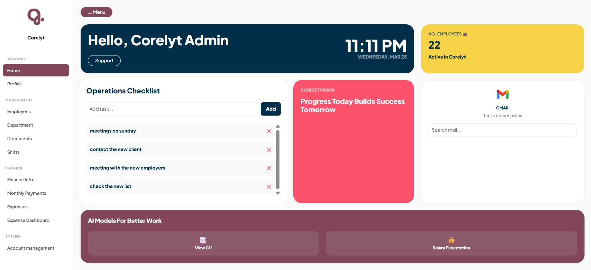
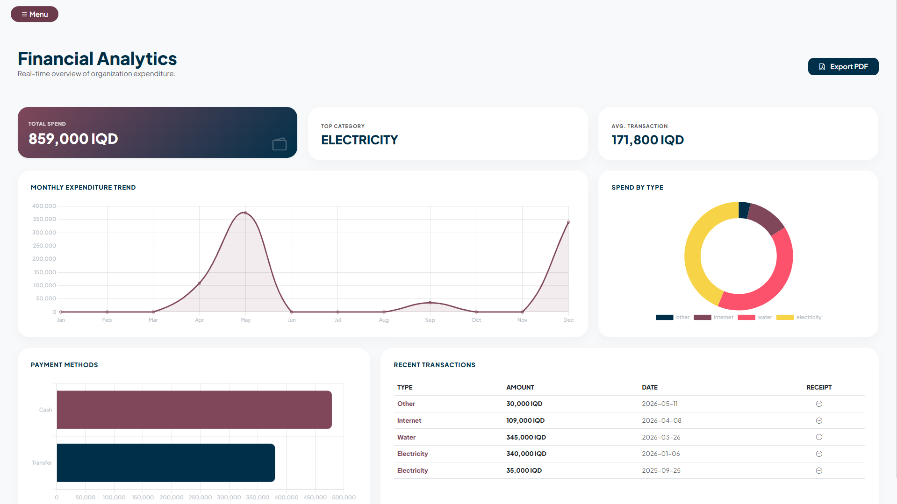
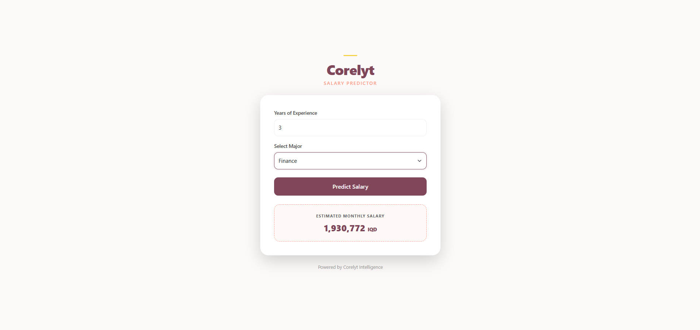
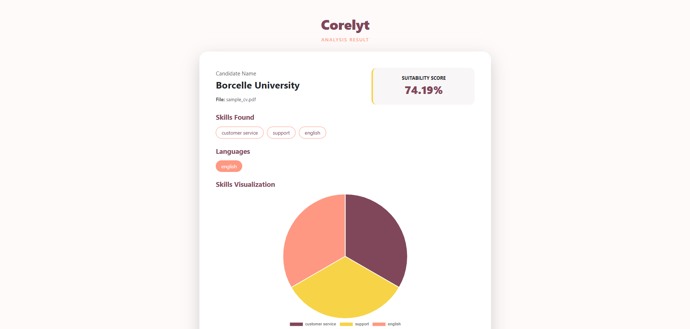
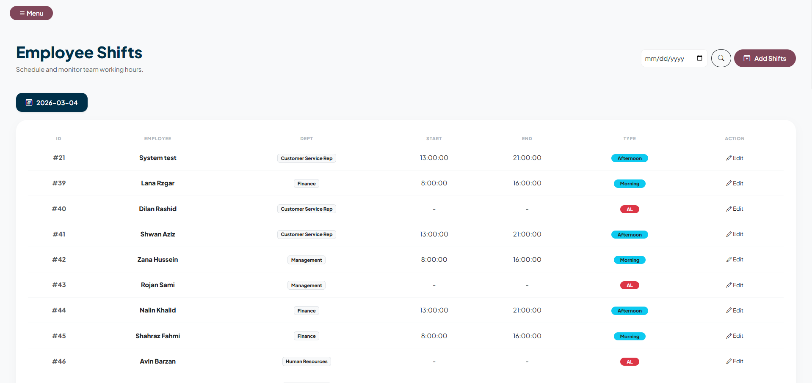

# Corelyt

> A Modern, Secure Database-Driven Web Platform with AI CV Analyzer & Salary Prediction

Corelyt is a highly secure, modern, and user-friendly web application built to manage structured data efficiently while providing intelligent AI-powered features such as CV analysis and salary expectation prediction.

---

##  Features
### High Security Architecture & Role-Based Access Control

- Advanced encrypted authentication system (secure password hashing & protected login flow)
- Secure session management with controlled access tokens
- Role-Based Access Control (RBAC) with dynamic permission layers
- Department-based access visibility (e.g., HR users can only access HR modules, Finance users can only access financial dashboards)
- Tab and feature restriction based on user role & email authorization
- Protected database interactions using prepared statements / ORM
- Granular access logging and activity monitoring

### AI CV Analyzer
- Upload CV (PDF)  
- Analyze suitability for Call Center Representative role  
- Highlight matched skills  
- Provide a "fit score" percentage for the role 

### Salary Predictor
- Predicts expected salary using linear regression  
- Based on experience and skills  
- Data-driven, transparent prediction model

###  Modern UI/UX
- Clean dashboard interface
- Responsive design
- Fast performance
- Easy navigation
- Professional layout
- easy to learn to use

---

## Tech Stack

### Frontend
- HTML5, CSS3, JavaScript  
- Bootstrap for responsive design 

### Backend
- Python 
- RESTful API architecture

### Database
- MySQL 

###  Data Processing & Models
- Python for data handling  
- Logistic regression for CV analysis  
- Linear regression for salary prediction  
- PDF/Text parsing for CVs  

## Authors: Anas abdulrahman - Rozhyar Hawezy

## Here are a few screenshots of the project:

